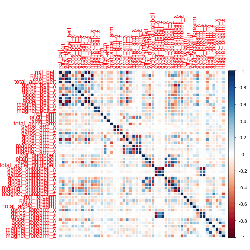
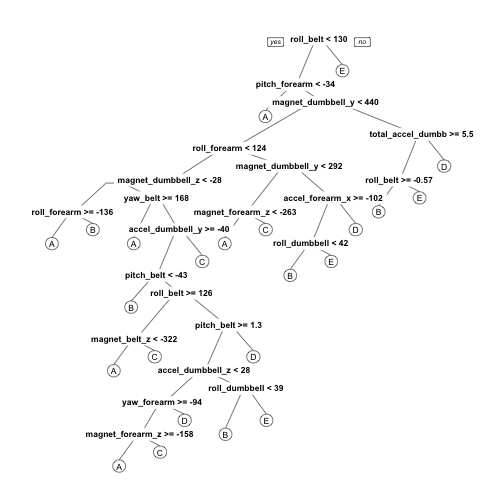

# Introduction

Using devices such as Jawbone Up, Nike FuelBand, and Fitbit it is now possible to collect a large amount of data about personal activity relatively inexpensively. These type of devices are part of the quantified self movement - a group of enthusiasts who take measurements about themselves regularly to improve their health, to find patterns in their behavior, or because they are tech geeks. One thing that people regularly do is quantify how much of a particular activity they do, but they rarely quantify how well they do it.

In this project, we will use data from accelerometers on the belt, forearm, arm, and dumbell of 6 participants to predict the manner in which they did the exercise.

# Data Processing

## Loading Libraries and Read the Data


```r
library(e1071)
library(ggplot2)
library(randomForest)
library(caret)
library(readr)
library(rpart)
library(rpart.plot)
library(corrplot)

# First download the data in your working directory

data <- read.csv(file="/Users/Dex/SkyDrive/Documentos/BigData/dataSample/pml-training.csv")
dtest <- read.csv(file="/Users/Dex/SkyDrive/Documentos/BigData/dataSample/pml-testing.csv")
```

The training data set contains 19622 observations and 160 variables, while the testing data set contains 20 observations and 160 variables. The "classe" variable in the training set is the outcome to predict.

## Preprocess the Data

We are going to remove columns with NA values and not related with accelerometer measurements.  We are going to do this with training and test data.


```r
# remove columms that contains NA values
sum(complete.cases(data))
```

```
## [1] 406
```

```r
data <- data[, colSums(is.na(data)) == 0]
dtest <- dtest[, colSums(is.na(dtest)) == 0]

# remove columns not related with accelerometer measurements
classe <- data$classe
dataWC <- grepl("^X|timestamp|window", names(data))
data <- data[, !dataWC]
dataclean <- data[, sapply(data, is.numeric)]
dataclean$classe <- classe


dtestWC <- grepl("^X|timestamp|window", names(dtest))
dtest <- dtest[, !dtestWC]
dtestclean <- dtest[, sapply(dtest, is.numeric)]
```

As result of this operation we have 19622 observations and 53 variables in the training set and 20 observations and 53 variables in the testing set.

# Split the Data

Now we are going to split the training set into 80% of training data and 20% of validation data.


```r
set.seed(53165) #set for reproducibility
inTrain <- createDataPartition(dataclean$classe, p=0.8, list=FALSE)
training <- dataclean[inTrain,]
testing <- dataclean[-inTrain,]
```

# Cross-Validation and Prediction Function

We are going to use a Random Forest function because it is robust and choose the more important features. This instead of using PCA.  Also we cross-validate using bootstraping when we are training the model.


```r
trControl <- trainControl(method = "boot", number = 10)

modelFit <- train(training$classe ~ ., method = "rf", ntree = 250, data=training, trControl = trControl)
modelFit
```

```
## Random Forest 
## 
## 15699 samples
##    52 predictor
##     5 classes: 'A', 'B', 'C', 'D', 'E' 
## 
## No pre-processing
## Resampling: Bootstrapped (10 reps) 
## Summary of sample sizes: 15699, 15699, 15699, 15699, 15699, 15699, ... 
## Resampling results across tuning parameters:
## 
##   mtry  Accuracy   Kappa      Accuracy SD  Kappa SD   
##    2    0.9899347  0.9872741  0.002087020  0.002629358
##   27    0.9900909  0.9874722  0.002229671  0.002809524
##   52    0.9825856  0.9779833  0.004401408  0.005547239
## 
## Accuracy was used to select the optimal model using  the largest value.
## The final value used for the model was mtry = 27.
```

Now we are going to test our model with the validation set and see the accuracy and out of sample error.


```r
predictRf <- predict(modelFit, testing)
confusionMatrix(testing$classe, predictRf)
```

```
## Confusion Matrix and Statistics
## 
##           Reference
## Prediction    A    B    C    D    E
##          A 1116    0    0    0    0
##          B   10  749    0    0    0
##          C    0    2  678    4    0
##          D    0    0    6  637    0
##          E    0    0    1    1  719
## 
## Overall Statistics
##                                           
##                Accuracy : 0.9939          
##                  95% CI : (0.9909, 0.9961)
##     No Information Rate : 0.287           
##     P-Value [Acc > NIR] : < 2.2e-16       
##                                           
##                   Kappa : 0.9923          
##  Mcnemar's Test P-Value : NA              
## 
## Statistics by Class:
## 
##                      Class: A Class: B Class: C Class: D Class: E
## Sensitivity            0.9911   0.9973   0.9898   0.9922   1.0000
## Specificity            1.0000   0.9968   0.9981   0.9982   0.9994
## Pos Pred Value         1.0000   0.9868   0.9912   0.9907   0.9972
## Neg Pred Value         0.9964   0.9994   0.9978   0.9985   1.0000
## Prevalence             0.2870   0.1914   0.1746   0.1637   0.1833
## Detection Rate         0.2845   0.1909   0.1728   0.1624   0.1833
## Detection Prevalence   0.2845   0.1935   0.1744   0.1639   0.1838
## Balanced Accuracy      0.9956   0.9971   0.9940   0.9952   0.9997
```


```r
accuracy <- postResample(predictRf, testing$classe)
accuracy
```

```
##  Accuracy     Kappa 
## 0.9938822 0.9922595
```

```r
outse <- 1 - as.numeric(confusionMatrix(testing$classe, predictRf)$overall[1])
outse
```

```
## [1] 0.006117767
```

Our estimation of accuracy is 0.9938822, 0.9922595 and the estimation of out of sample error is 0.0061178.

# Results with the test data set


```r
result <- predict(modelFit, dtestclean[, -length(names(dtestclean))])
result
```

```
##  [1] B A B A A E D B A A B C B A E E A B B B
## Levels: A B C D E
```

# Appendix: Figures

## Correlation Matrix.

```r
corrPlot <- cor(training[, -length(names(training))])
corrplot(corrPlot, method="color")
```

 

## Decision Tree

```r
treeModel <- rpart(classe ~ ., data=training, method="class")
prp(treeModel)
```

 

